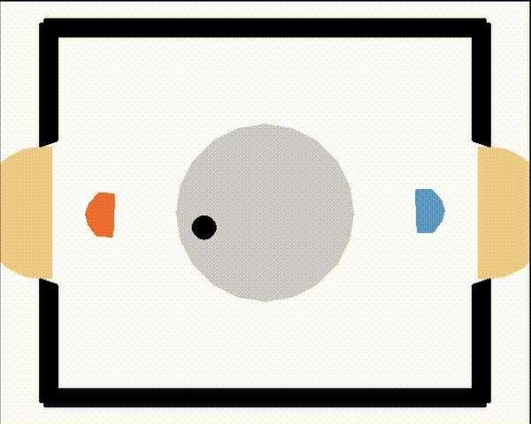

# rl-m3ddpg

A general pytorch implementation of the Minimax Multi-Agent Deep Deterministic Policy Gradient (M3DDPG) [[1]](#1) Algorithm used for multiagent reinforcment learning.

M3DDPG is an extension to the Multi-Agent Deep Deterministic Policy Gradient (MADDPG) [[2]](#2) Algorithm. MADDPG uses critics with access to the actions of all agents to evaluate the action of a specific agent in the context of the actions of the other agents.
M3DDPG aditionally uses a worst case estimate, both in training the critics and the actors to make the learned policies more robost against previously unseen opposing policies.

## Features

- Interface for interpreting gym environments as multi-agent environment. Gym environments are not designed to support multi-agent environments nativly therefore a wrapper is used to interpret any gym environment as a multi-agent environment.

- Support for independent action and observation spaces. As described in the Paper [[1]](#1)[[2]](#2), different agents may have different observation spaces and action spaces. This implemention supports this property.

- Support for burnin policies. Specific (potentially hard coded) policies which are used at the beginning of training to kick start the training process.

- Implementing two improvments from the Twin Delayed Deep Deterministic Policy Gradient (TD3) [[3]](#3) algorithm. Namely delayed targetnets and the addition of noise to the target Q-values. While the focus of this implementation is not performance but rather readability, the twin networks addition has been left out, as this would have slowed down this implementation significantly.

## How to use on a gym environment

1. Implement the `Multiagent_laserhockey_wrapper` interface from `multiagent_wrapper.py` with all necessary methods. This indicates how to interpret the environment as multiagent environment.

2. Create an actor for each agent. These have to inherit the `torch.nn.Module` interface.

3. Create an critic for each agent. These have to inherit the `Multiagent_critic` interface from `multiagent_critic.py`. A special implementation of the `forward` function is needed that tells the critic how to process the environment state in combination with a list of all actions taken by all agents.

4. Choose hyperparameters.

5. Start training.

## Example implementation

The laser-hockey environment [[4]](#4) is two a player hockey game. Therefore it can be interpreted as a multiagent and enviroments. An example implementation using this environment can be found in `example_laser-hockey.ipynb`. This environment needs further requirments not listed in `requirments.txt`. Please refer to the referenced repository[[4]](#4) for the requirments.

The following animation shows two agents trained by M3DDPG for approximatly 4,000,000 training steps. Used parameters can be found in `example_laser-hockey.ipynb` as well.

## References

<a id="1">[1]</a> Li, Shihui & Wu, Yi & Cui, Xinyue & Dong, Honghua & Fang, Fei & Russell, Stuart. (2019). Robust Multi-Agent Reinforcement Learning via Minimax Deep Deterministic Policy Gradient. Proceedings of the AAAI Conference on Artificial Intelligence. 33. 4213-4220. 10.1609/aaai.v33i01.33014213. 

<a id="2">[2]</a> Ryan Lowe, Yi Wu, Aviv Tamar, Jean Harb, Pieter Abbeel, and Igor Mordatch. 2017. Multi-agent actor-critic for mixed cooperative-competitive environments. In Proceedings of the 31st International Conference on Neural Information Processing Systems (NIPS'17). Curran Associates Inc., Red Hook, NY, USA, 6382–6393.

<a id="3">[3]</a>Fujimoto, S., Hoof, H. &amp; Meger, D.. (2018). Addressing Function Approximation Error in Actor-Critic Methods. <i>Proceedings of the 35th International Conference on Machine Learning</i>, in <i>Proceedings of Machine Learning Research</i> 80:1587-1596 Available from http://proceedings.mlr.press/v80/fujimoto18a.html.

<a id="4">[4]</a> G. Martius, and S. Blaes.  A simple laser-hockey gym environment for RL agents. https://github.com/martius-lab/laser-hockey-env, 2021. (In case the original repository has been altered to incompatibility, this fork contains the version used during the development https://github.com/Sebastian-Griesbach/laser-hockey-env)

